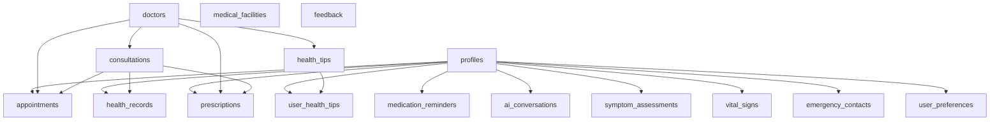

# HealthWise AI - Database Schema Documentation

## Overview

This document provides comprehensive documentation for the HealthWise AI application database schema. The database is built on Supabase PostgreSQL and includes 15 core tables designed to support a complete health management platform with AI-powered features.

## Architecture Principles

- **Security First**: Row Level Security (RLS) enabled on all tables
- **Scalability**: Optimized indexes for high-performance queries
- **Data Integrity**: Foreign key constraints and check constraints
- **Audit Trail**: Created/updated timestamps on all relevant tables
- **Flexibility**: JSONB fields for complex data structures

## Database Schema Overview



## Core Tables

### 1. profiles

**Purpose**: Central user profile and health information storage

| Column              | Type         | Description                                   |
| ------------------- | ------------ | --------------------------------------------- |
| id                  | UUID         | Primary key                                   |
| user_id             | UUID         | Reference to auth.users (unique)              |
| full_name           | TEXT         | User's full name                              |
| date_of_birth       | DATE         | Birth date for age calculations               |
| gender              | TEXT         | Gender (male/female/other/prefer_not_to_say)  |
| height_cm           | INTEGER      | Height in centimeters                         |
| weight_kg           | DECIMAL(5,2) | Weight in kilograms                           |
| blood_type          | TEXT         | Blood type (A+, A-, B+, B-, AB+, AB-, O+, O-) |
| allergies           | TEXT[]       | Array of known allergies                      |
| medical_conditions  | TEXT[]       | Array of medical conditions                   |
| current_medications | TEXT[]       | Array of current medications                  |
| insurance_provider  | TEXT         | Health insurance provider                     |
| profile_completed   | BOOLEAN      | Profile completion status                     |

**Key Features**:

- Enhanced blood type validation
- Flexible array fields for medical data
- Insurance information support
- Profile completion tracking

### 2. doctors

**Purpose**: Healthcare provider profiles for telehealth services

| Column           | Type          | Description                     |
| ---------------- | ------------- | ------------------------------- |
| id               | UUID          | Primary key                     |
| full_name        | TEXT          | Doctor's full name              |
| email            | TEXT          | Professional email (unique)     |
| specialty        | TEXT          | Medical specialty               |
| license_number   | TEXT          | Medical license number (unique) |
| experience_years | INTEGER       | Years of experience             |
| consultation_fee | DECIMAL(10,2) | Consultation fee amount         |
| rating           | DECIMAL(3,2)  | Average rating (0.00-5.00)      |
| available_hours  | JSONB         | Weekly availability schedule    |
| is_verified      | BOOLEAN       | Verification status             |
| is_active        | BOOLEAN       | Active status                   |

**Key Features**:

- Professional credential verification
- Flexible scheduling system
- Rating and review system
- Multi-language support

### 3. consultations

**Purpose**: Telehealth consultation sessions management

| Column            | Type          | Description                       |
| ----------------- | ------------- | --------------------------------- |
| id                | UUID          | Primary key                       |
| user_id           | UUID          | Patient reference                 |
| doctor_id         | UUID          | Doctor reference                  |
| consultation_type | TEXT          | Type (video/phone/chat/ai_triage) |
| status            | TEXT          | Current status                    |
| scheduled_at      | TIMESTAMPTZ   | Scheduled appointment time        |
| consultation_fee  | DECIMAL(10,2) | Session fee                       |
| diagnosis         | TEXT          | Doctor's diagnosis                |
| recommendations   | TEXT          | Treatment recommendations         |
| meeting_link      | TEXT          | Video call link                   |

**Key Features**:

- Multiple consultation types
- Session recording support
- Payment tracking
- Follow-up management

### 4. health_records

**Purpose**: Comprehensive health record management (enhanced)

| Column          | Type    | Description                               |
| --------------- | ------- | ----------------------------------------- |
| id              | UUID    | Primary key                               |
| user_id         | UUID    | Patient reference                         |
| record_type     | TEXT    | Type of health record                     |
| title           | TEXT    | Record title                              |
| data            | JSONB   | Structured health data                    |
| doctor_id       | UUID    | Associated doctor (optional)              |
| consultation_id | UUID    | Associated consultation (optional)        |
| severity        | TEXT    | Severity level (low/medium/high/critical) |
| is_chronic      | BOOLEAN | Chronic condition flag                    |
| tags            | TEXT[]  | Searchable tags                           |

**Enhanced Features**:

- Severity classification
- Chronic condition tracking
- Doctor association
- Flexible tagging system

### 5. medication_reminders

**Purpose**: Advanced medication tracking and reminders (enhanced)

| Column             | Type    | Description                       |
| ------------------ | ------- | --------------------------------- |
| id                 | UUID    | Primary key                       |
| user_id            | UUID    | Patient reference                 |
| medication_name    | TEXT    | Medication name                   |
| generic_name       | TEXT    | Generic drug name                 |
| brand_name         | TEXT    | Brand name                        |
| dosage_form        | TEXT    | Form (tablet/capsule/liquid/etc.) |
| strength           | TEXT    | Medication strength               |
| food_instructions  | TEXT    | Food-related instructions         |
| side_effects       | TEXT[]  | Known side effects                |
| interactions       | TEXT[]  | Drug interactions                 |
| is_as_needed       | BOOLEAN | PRN medication flag               |
| quantity_remaining | INTEGER | Remaining quantity                |

**Enhanced Features**:

- Comprehensive medication details
- Food instruction support
- Side effect tracking
- Interaction warnings
- Refill reminders

### 6. ai_conversations

**Purpose**: AI chat history and interaction tracking

| Column            | Type    | Description             |
| ----------------- | ------- | ----------------------- |
| id                | UUID    | Primary key             |
| user_id           | UUID    | User reference          |
| session_id        | UUID    | Conversation session ID |
| conversation_type | TEXT    | Type of AI interaction  |
| message_role      | TEXT    | Role (user/assistant)   |
| message_content   | TEXT    | Message content         |
| message_metadata  | JSONB   | Additional metadata     |
| response_time_ms  | INTEGER | AI response time        |
| feedback_rating   | INTEGER | User feedback (1-5)     |

**Key Features**:

- Session-based conversation tracking
- Performance monitoring
- User feedback collection
- Metadata support for context

### 7. symptom_assessments

**Purpose**: AI-powered symptom analysis results

| Column              | Type    | Description                         |
| ------------------- | ------- | ----------------------------------- |
| id                  | UUID    | Primary key                         |
| user_id             | UUID    | Patient reference                   |
| session_id          | UUID    | Assessment session ID               |
| symptoms_reported   | TEXT[]  | List of reported symptoms           |
| symptoms_data       | JSONB   | Detailed symptom information        |
| ai_analysis         | TEXT    | AI analysis results                 |
| possible_conditions | JSONB   | Possible conditions with likelihood |
| urgency_level       | TEXT    | Urgency (low/medium/high/emergency) |
| recommendations     | TEXT[]  | AI recommendations                  |
| follow_up_required  | BOOLEAN | Follow-up flag                      |
| accuracy_rating     | INTEGER | User accuracy feedback              |

**Key Features**:

- Comprehensive symptom tracking
- AI-powered analysis
- Urgency classification
- User feedback on accuracy

### 8. prescriptions

**Purpose**: AI-generated and doctor prescriptions management

| Column              | Type    | Description                           |
| ------------------- | ------- | ------------------------------------- |
| id                  | UUID    | Primary key                           |
| user_id             | UUID    | Patient reference                     |
| doctor_id           | UUID    | Prescribing doctor (optional)         |
| prescription_type   | TEXT    | Type (ai_generated/doctor_prescribed) |
| prescription_data   | JSONB   | Complete prescription details         |
| medications         | JSONB   | Prescribed medications array          |
| verification_status | TEXT    | Verification status                   |
| verified_by         | UUID    | Verifying doctor                      |
| expiry_date         | DATE    | Prescription expiry                   |
| refills_allowed     | INTEGER | Number of refills allowed             |

**Key Features**:

- AI and doctor prescription support
- Verification workflow
- Refill tracking
- Comprehensive medication details

### 9. vital_signs

**Purpose**: Health measurements and vitals tracking

| Column           | Type          | Description               |
| ---------------- | ------------- | ------------------------- |
| id               | UUID          | Primary key               |
| user_id          | UUID          | Patient reference         |
| measurement_type | TEXT          | Type of measurement       |
| value_numeric    | DECIMAL(10,3) | Numeric value             |
| unit             | TEXT          | Measurement unit          |
| systolic         | INTEGER       | Systolic pressure (BP)    |
| diastolic        | INTEGER       | Diastolic pressure (BP)   |
| measured_at      | TIMESTAMPTZ   | Measurement timestamp     |
| device_used      | TEXT          | Measuring device          |
| is_manual_entry  | BOOLEAN       | Manual vs automatic entry |

**Supported Measurements**:

- Blood pressure (systolic/diastolic)
- Heart rate
- Temperature
- Weight/Height
- Blood sugar
- Oxygen saturation
- Steps
- Sleep hours

### 10. medical_facilities

**Purpose**: Nearby hospitals, clinics, and pharmacies

| Column        | Type | Description                                 |
| ------------- | ---- | ------------------------------------------- |
| id            | UUID | Primary key                                 |
| name          | TEXT | Facility name                               |
| facility_type | TEXT | Type (hospital/clinic/pharmacy/urgent_care) |
| address       | TEXT | Physical address                            |

| services | TEXT[] | Available services |
| specialties | TEXT[] | Medical specialties |
| emergency_services | BOOLEAN | Emergency services flag |
| wheelchair_accessible | BOOLEAN | Accessibility flag |
| opening_hours | JSONB | Operating hours |
| rating | DECIMAL(3,2) | User rating |

**Key Features**:

- Service and specialty filtering
- Accessibility information
- Operating hours
- Emergency services identification
- City and address-based search

## Support Tables

### 11. health_tips

**Purpose**: Health education content and tips

| Column            | Type    | Description                 |
| ----------------- | ------- | --------------------------- |
| id                | UUID    | Primary key                 |
| title             | TEXT    | Tip title                   |
| content           | TEXT    | Tip content                 |
| category          | TEXT    | Content category            |
| tags              | TEXT[]  | Searchable tags             |
| target_conditions | TEXT[]  | Target medical conditions   |
| difficulty_level  | TEXT    | Implementation difficulty   |
| is_ai_generated   | BOOLEAN | AI-generated flag           |
| is_verified       | BOOLEAN | Medical verification status |
| view_count        | INTEGER | View statistics             |

### 12. user_health_tips

**Purpose**: User interactions with health tips

| Column           | Type        | Description                      |
| ---------------- | ----------- | -------------------------------- |
| user_id          | UUID        | User reference                   |
| tip_id           | UUID        | Health tip reference             |
| interaction_type | TEXT        | Type (viewed/liked/saved/shared) |
| created_at       | TIMESTAMPTZ | Interaction timestamp            |

### 13. feedback

**Purpose**: User feedback and support system

| Column        | Type    | Description                             |
| ------------- | ------- | --------------------------------------- |
| id            | UUID    | Primary key                             |
| user_id       | UUID    | User reference (nullable for anonymous) |
| feedback_type | TEXT    | Type of feedback                        |
| message       | TEXT    | Feedback content                        |
| rating        | INTEGER | Rating (1-5)                            |
| status        | TEXT    | Processing status                       |
| priority      | TEXT    | Priority level                          |

### 14. user_preferences

**Purpose**: Application settings and preferences

| Column                | Type    | Description                       |
| --------------------- | ------- | --------------------------------- |
| user_id               | UUID    | User reference (unique)           |
| theme                 | TEXT    | UI theme preference               |
| language              | TEXT    | Language preference               |
| notifications_enabled | BOOLEAN | Notification settings             |
| measurement_units     | TEXT    | Unit preference (metric/imperial) |
| privacy_level         | TEXT    | Privacy level                     |

### 15. emergency_contacts

**Purpose**: Emergency contact information

| Column         | Type    | Description          |
| -------------- | ------- | -------------------- |
| id             | UUID    | Primary key          |
| user_id        | UUID    | User reference       |
| name           | TEXT    | Contact name         |
| relationship   | TEXT    | Relationship to user |
| phone          | TEXT    | Phone number         |
| is_primary     | BOOLEAN | Primary contact flag |
| priority_order | INTEGER | Contact priority     |

## Security Implementation

### Row Level Security (RLS)

All tables have RLS enabled with policies ensuring:

- Users can only access their own data
- Doctors can access patient data during consultations
- Public data (health tips, facilities) is accessible to all
- Anonymous feedback is supported

### Key Security Policies

1. **User Data Isolation**: Users can only CRUD their own records
2. **Doctor Access**: Limited access to patient data during active consultations
3. **Admin Functions**: Separate policies for administrative operations
4. **Public Data**: Open access to verified health content

## Performance Optimization

### Indexes

- **User-centric indexes**: Fast user data retrieval
- **Search indexes**: Full-text search on content
- **Temporal indexes**: Date-based queries for appointments/records
- **Composite indexes**: Multi-column query optimization
- **City/region indexes**: Location-based facility searches

### Query Patterns

- User dashboard: Single query with joins
- Health timeline: Chronological data retrieval
- Medication reminders: Time-based filtering
- Facility search: City and service-based queries

## Data Relationships

### Primary Relationships

- `profiles` ← Many-to-one → `auth.users`
- `consultations` ← Many-to-one → `doctors`
- `consultations` ← One-to-many → `appointments`
- `health_records` ← Many-to-one → `consultations`
- `prescriptions` ← Many-to-one → `consultations`

### Reference Data

- `health_tips`: Curated by medical professionals
- `medical_facilities`: Verified facility information
- `doctors`: Verified healthcare providers

## Migration Strategy

### Migration Files

1. `20250822000000_comprehensive_schema.sql` - Core schema creation
2. `20250822000001_rls_policies.sql` - Security policies
3. `20250822000002_indexes.sql` - Performance indexes
4. `20250822000003_sample_data.sql` - Test data

### Deployment Steps

1. Run migrations in sequence
2. Verify RLS policies
3. Test query performance
4. Populate reference data
5. Validate application integration

## API Usage Patterns

### Common Queries

```typescript
// User health dashboard
const { data: profile } = await supabase
  .from("profiles")
  .select("*, health_records(*), medication_reminders(*)")
  .eq("user_id", userId)
  .single();

// Medical facilities by city
const { data: facilities } = await supabase
  .from("medical_facilities")
  .select("*")
  .eq("is_active", true)
  .eq("city", "Springfield")
  .order("rating", { ascending: false });

// AI conversation history
const { data: messages } = await supabase
  .from("ai_conversations")
  .select("*")
  .eq("user_id", userId)
  .eq("session_id", sessionId)
  .order("created_at");
```

## Backup and Recovery

### Backup Strategy

- Daily automated backups via Supabase
- Point-in-time recovery available
- Export capabilities for compliance

### Data Retention

- User data: Retained per user preference
- AI conversations: 2-year retention
- Health records: Permanent retention
- Audit logs: 7-year retention

## Compliance Considerations

### HIPAA Compliance

- Encryption at rest and in transit
- Audit logging for all access
- User consent tracking
- Data anonymization capabilities

### GDPR Compliance

- Right to be forgotten implementation
- Data portability support
- Consent management
- Privacy by design principles

## Monitoring and Analytics

### Performance Metrics

- Query response times
- Database connection pool usage
- Storage growth patterns
- Index effectiveness

### Health Metrics

- User engagement patterns
- AI accuracy feedback
- Feature adoption rates
- Error tracking

## Support and Maintenance

### Regular Tasks

- Index optimization
- Query performance review
- Security audit
- Data cleanup

### Scaling Considerations

- Read replicas for analytics
- Connection pooling optimization
- Partitioning strategies for large tables
- Caching layer implementation

---

**Last Updated**: August 22, 2025
**Version**: 1.0.0
**Maintainer**: HealthWise AI Development Team
